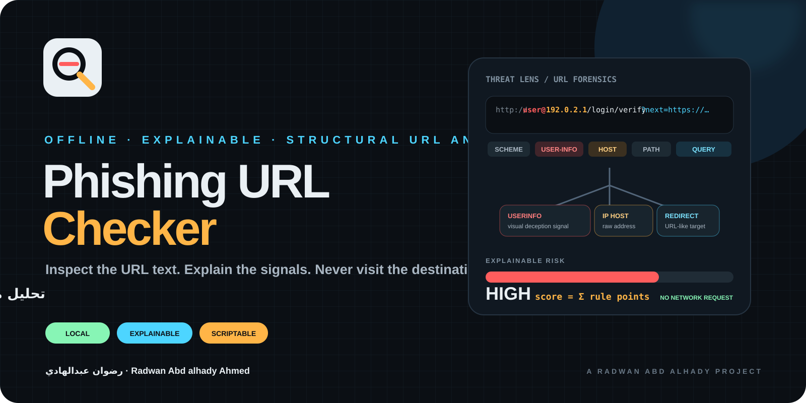

<div align="center">




# Phishing URL Checker — الدليل العربي

**تحليل محلي لبنية الروابط مع نتيجة قابلة للتفسير، من دون زيارة الموقع.**

[](https://github.com/rad03i2/phishing-url-checker/actions/workflows/ci.yml)

**[الصفحة الرئيسية](README.md) · [English](README_EN.md) · [المعمارية](docs/ARCHITECTURE.md) · [الأمان](SECURITY.md)**

</div>

---

<div dir="rtl" align="right">

## فكرة المشروع

تفحص الأداة **نص وبنية رابط HTTP أو HTTPS فقط** وتبحث عن مؤشرات شائعة يمكن أن تظهر في روابط التصيد، من دون فتح الرابط أو حل اسم النطاق أو إرسال الرابط إلى خدمة خارجية.

النتيجة إرشادية وليست حكمًا نهائيًا على الرابط.

## ما الذي تفحصه الأداة فعليًا؟

- استخدام HTTP بدل HTTPS.
- وجود User Info قبل اسم المضيف.
- استخدام عنوان IP مباشر كمضيف.
- Punycode.
- كثرة النطاقات الفرعية.
- بعض خدمات اختصار الروابط المعروفة.
- قائمة محددة من TLDs التي تحصل على إشارة تحذير منخفضة الوزن.
- المنافذ غير القياسية للويب.
- طول الرابط الكبير.
- كثرة الشرطات في اسم المضيف.
- وجود عدة كلمات مرتبطة بالحساب/الدخول في المسار أو الاستعلام.
- معاملات Redirect التي تبدو كأنها تحتوي رابطًا آخر.
- بعض المحارف المشفرة داخل Authority.

كل إشارة تظهر مع كود ومستوى ونقاط ورسالة تفسيرية.

## التثبيت

</div>

```bash
git clone https://github.com/rad03i2/phishing-url-checker.git
cd phishing-url-checker
python -m pip install -e .
```

<div dir="rtl" align="right">

للتطوير والاختبار:

</div>

```bash
python -m pip install -e . pytest
```

<div dir="rtl" align="right">

## الاستخدام

</div>

```bash
phishcheck https://example.com
phishcheck "http://user@192.0.2.1/login/verify"
phishcheck --file examples/urls.txt
phishcheck https://example.com --json
phishcheck suspicious-url-here --fail-on high
python -m phishing_url_checker https://example.com
```

<div dir="rtl" align="right">

## مستويات النتيجة

</div>

```text
0       = minimal
1..24   = low
25..49  = medium
50..100 = high
```

<div dir="rtl" align="right">

تجمع الأداة نقاط القواعد الحالية ثم تحدّ النتيجة النهائية عند 100.

## واجهة Python

</div>

```python
from phishing_url_checker import analyze_url

report = analyze_url("https://example.com/account/verify")
print(report.risk, report.score)

for finding in report.findings:
    print(finding.code, finding.severity, finding.points)
```

<div dir="rtl" align="right">

## الخصوصية

أثناء التحليل لا تقوم الأداة عمدًا بـ:

- DNS lookup.
- فتح HTTP أو HTTPS.
- اتباع Redirects.
- توسيع الروابط المختصرة.
- فحص شهادة الموقع.
- الاستعلام من قواعد Reputation أو Threat Intelligence.
- إرسال Telemetry.

وهذا جزء أساسي من تصميم المشروع وليس مجرد خيار تشغيل.

## القيود المهمة

النتيجة المنخفضة لا تثبت أن الرابط آمن، والنتيجة المرتفعة لا تثبت وحدها أن الرابط خبيث. قد يكون رابط تصيد متقنًا من الناحية البنيوية، وقد تستخدم خدمة سليمة بنية تؤدي إلى تحذيرات.

للقرارات المهمة اجمع هذا التحليل مع حماية المتصفح وسياسات المؤسسة ومعلومات النطاق والسمعة والتحقق البشري.

## الاختبارات

</div>

```bash
python -m compileall -q src tests
python -m pytest -q
```

<div dir="rtl" align="right">

يعمل CI عبر Python 3.10 و3.12 و3.13 على Ubuntu وWindows وmacOS.

## الوثائق

- [المعمارية والقواعد](docs/ARCHITECTURE.md)
- [الهوية البصرية](docs/BRAND.md)
- [سياسة الأمان](SECURITY.md)
- [الدعم](SUPPORT.md)
- [المساهمة](CONTRIBUTING.md)
- [سجل التغييرات](CHANGELOG.md)
- [الترخيص](LICENSE)

## المطور

**رضوان عبدالهادي**  
**Radwan Abd alhady Ahmed**  
GitHub: [@rad03i2](https://github.com/rad03i2)

</div>
